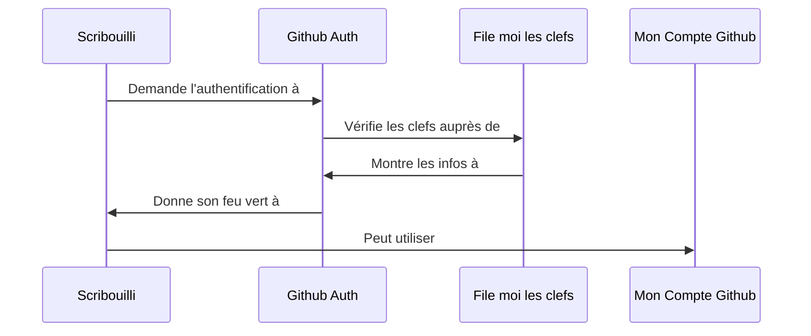

# scribouilli

## Installation

- Ouvrir un terminal
- Récupérer le repo `git clone git@github.com:lechappeebelle/scribouilli.git` dans le dossier qui va bien
- Rentrer dans le dossier `scribouilli`
- Faire `npm install`
- Builder le projet avec `npm run dev` (?)
- Lancer le projet avec `npm start`
- Ouvrir dans votre navigateur préféré `http://localhost:8080/`

## Intention 
0/
Permettre à des non-informaticiennes 
- de créer un petit site rapidement / facilement 
- avoir une relation saine et sereine avec son contenu

## Schema

## Benchmark (-->Wix/Wordpress)
### Wix = logiciel privateur
- "liberté de créer, gérer et développer"
- "site professionnel" (boutique, blog, réservation)
- "personnalisable", "sur-mesure" (mais "template"), "questionnaire", "modèle design"
- "mobile"
- "visibilité", "référencement", "développez votre entreprise", "image de marque"
- impression de dynamisme
- impression de rapidité
- "gratuit"
- "facile"
- "Bénéficiez d'une solution tout-en-un : hébergement Web fiable et gratuit, sécurité maximale, référencement puissant et assistance 24h/24."
- "Plus de 180 millions de personnes dans le monde ont déjà choisi Wix pour créer un site Web gratuit."

### Wordpress = logiciel libre dont le format nécessite une machine pour être lu
- en anglais
- "Create a place for your business, your interests, or anything else—with the open source platform that powers the web."
- "dream it, build it", "custom", "flexible design tools"
- "intuitive"
- "powerful features" (store, mailing list, portfolio, social feed, analytics)
- "Own what you make", "Your content, your design, and your data always belong to you.", "open source community"
- "community", "around the world", "spirit of open source", "share", "freedom", "contribute", "Let’s shape the future of the web together."
- "as stable and secure as possible"
- adapté à tous les profils ("Whether you’re an entrepreneur, professional developer, or first-time blogger")

## Note

Pour rendre accessible une nouvelle route :
- créer un lien symbolique qui pointe vers `index.html` ;
  - `ln -s index.html <ma-route.html>`
- créer la route dans [assets/scripts/scripts.js]

