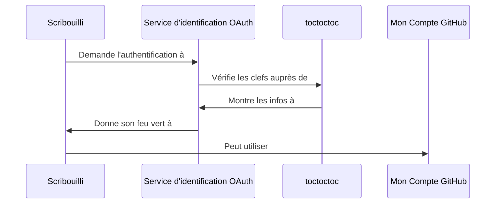

# scribouilli

[Scribouilli](https://scribouilli.org) est un outil pour créer un petit site
facilement. L'intention, c'est de permettre à des non-informaticiennes de créer
un petit site rapidement / facilement et d'avoir une relation saine et sereine
avec son contenu.

## Installation

- Ouvrir un terminal
- Récupérer le repo `git clone git@github.com:lechappeebelle/scribouilli.git` dans le dossier qui va bien
- Rentrer dans le dossier `scribouilli`
- Faire `npm install`
- Builder le projet avec `npm run dev`
- Lancer le projet avec `npm start` dans un autre terminal
- Ouvrir dans votre navigateur préféré `http://localhost:8080/`

## Développement

- Forker le repo sur votre compte
- Modifier les settings
  - Donner les droits en écriture a _github action_
  - Pour déployer la branche `online`
- Ajouter votre origine github pages (ex: `yaf.github.io`) dans [Scribouilli/toctoctoc/allowlist.csv](https://github.com/Scribouilli/toctoctoc/blob/main/allowlist.csv)

Voilà à quoi ça peut ressembler : [github.com/yaf/scribouilli](https://github.com/yaf/scribouilli)

Une fois les développements réalisés, vous pouvez faire une PR dans Scribouilli, en précisant votre url de développement pour que l'on puisse tester la modification.

### Outils de développement

Des pre-commit hooks sont installés automatiquement avec `husky`. Si jamais il sont trop contraignants,
il est possible de les ignorer avec l'option `--no-verify` de `git commit`.

Vous pouvez également lancer les tests en local avec :

```
npm run test
```

### Note

Pour rendre accessible une nouvelle route :

- créer un lien symbolique qui pointe vers `index.html` ;
  - `ln -s index.html <ma-route.html>`
- créer la route dans [assets/scripts/scripts.js]

## Schema



- `Service d'identification OAuth` : le service OAuth actuellement implémenté est [celui de GitHub](https://docs.github.com/en/apps/oauth-apps). On va intégrer prochainement GitLab.
- `toctoctoc` : un [serveur générique](https://github.com/Scribouilli/toctoctoc)
  qui permet de se connecter à un service d'identification OAuth.

## Ressources

- Notre [benchmark](/tree/principale/docs/benchmark.md) de départ
