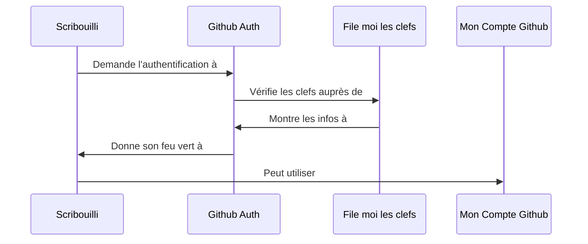

# scribouilli

## Installation

- Ouvrir un terminal
- Récupérer le repo `git clone git@github.com:daktary-team/scribouilli.git` dans le dossier qui va bien
- Rentrer dans le dossier `scribouilli`
- Faire `npm install`
- Builder le projet avec `npm run dev`
- Lancer le projet avec `npm start`
- Ouvrir dans votre navigateur préféré `http://localhost:3000/`

## Intention 

Permettre à des non-informaticiennes 
- de créer un petit site rapidement / facilement 
- avoir une relation saine et sereine avec son contenu

## Schema

